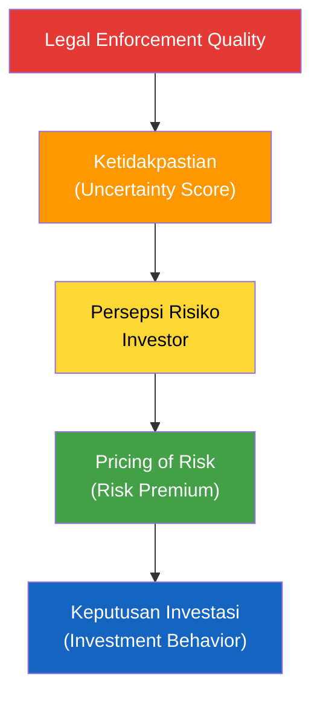

# Framework LEUI: Legal Enforcement Uncertainty Index

### CELIOS — Center of Economic and Law Studies
### Disusun: 31 Maret 2026

---

## 1. Premis Dasar (Core Assumption)

> Penegakan hukum yang tidak konsisten, tidak transparan, dan mudah dipolitisasi menciptakan **ketidakpastian hukum**, yang kemudian dikonversi oleh pelaku usaha menjadi **risiko ekonomi** yang di-*price* dalam keputusan investasi.

**Prinsip kunci:** Bukan hukum buruk yang paling mahal, tapi **hukum yang tak bisa diprediksi**.

---

## 2. Kerangka Konseptual (Causal Chain)



**Versi teknis:**
```
Legal Enforcement Quality Index → Legal Uncertainty Score → Legal Risk Premium → Investment Behavior
```

---

## 3. Lima Hipotesis (H1–H5)

### H1 — Inconsistency Risk
| Aspek | Detail |
|---|---|
| **Definisi** | Ketidakkonsistenan penegakan hukum antar wilayah, sektor, dan waktu |
| **Contoh** | Kasus serupa → hasil putusan berbeda; Izin sah → dikriminalisasi |
| **Tipe Uncertainty** | Outcome uncertainty |
| **Proxy Data** | Variansi putusan kasus sejenis |

### H2 — Selective Enforcement Risk
| Aspek | Detail |
|---|---|
| **Definisi** | Penegakan hukum yang selektif dan transaksional |
| **Contoh** | Penindakan hanya saat konflik politik; hukum sebagai alat negosiasi |
| **Tipe Uncertainty** | Political & discretion risk |
| **Proxy Data** | Rasio kasus terhadap momentum politik |

### H3 — Procedural Uncertainty Risk
| Aspek | Detail |
|---|---|
| **Definisi** | Proses hukum yang panjang, tidak pasti, dan mahal |
| **Contoh** | Pidana paralel PTUN/perdata; penyitaan aset pre-inkracht |
| **Tipe Uncertainty** | Process risk |
| **Proxy Data** | Rata-rata lama penyelesaian kasus |

### H4 — Regulatory Reversal Risk
| Aspek | Detail |
|---|---|
| **Definisi** | Penegakan hukum berubah karena perubahan regulasi/kebijakan mendadak |
| **Contoh** | Perizinan sah → melanggar aturan baru; pencabutan izin retroaktif |
| **Tipe Uncertainty** | Policy & regulatory risk |
| **Proxy Data** | Jumlah pencabutan izin |

### H5 — Criminalization Risk
| Aspek | Detail |
|---|---|
| **Definisi** | Kriminalisasi keputusan bisnis atau kebijakan administratif |
| **Contoh** | Direksi dijerat pidana; pejabat takut tanda tangan |
| **Tipe Uncertainty** | Personal & reputational risk |
| **Proxy Data** | Jumlah kasus pidana bisnis |

---

## 4. Mekanisme Risk Pricing

Investor tidak bilang "hukum buruk", tapi mereka merespons lewat **price channel**:

| Jenis Risiko | Cara Di-price | Variabel Proxy |
|---|---|---|
| Legal uncertainty | Risk premium ↑ | Spread bunga pinjaman |
| Enforcement risk | Cost of capital ↑ | ICOR (Incremental Capital-Output Ratio) |
| Criminalization risk | Insurance cost ↑ | Political risk insurance |
| Process risk | Delay cost ↑ | Time-to-invest |
| Regulatory reversal | Expected return ↓ | Capital flight / Net Sell |

---

## 5. Asumsi Kunci

1. Investor bersifat **risk-averse**
2. Ketidakpastian hukum **≠** buruknya hukum substantif
3. Risiko hukum bisa **dipersepsikan dan dihitung** (melalui proxy)
4. Penegakan hukum **lebih menentukan** dari teks hukum
5. Data proxy **cukup** untuk mengukur persepsi risiko

---

## 6. Pertanyaan Riset

### Utama:
> **Bagaimana penegakan hukum di Indonesia menciptakan risiko yang di-price dalam keputusan investasi?**

### Turunan:
1. Aspek penegakan hukum apa yang **paling mahal** secara ekonomi?
2. Apakah ketidakpastian hukum meningkatkan **cost of capital** (ICOR)?
3. Apakah investor lebih takut pada **hukum buruk** atau **hukum tak terduga**?
4. Apakah efeknya **berbeda antar sektor & daerah**?
5. Bagaimana investor **memitigasi** risiko hukum (capital flight, risk premium)?

---

## 7. Output Riset yang Ditargetkan

| Output | Deskripsi |
|---|---|
| **Legal Risk Pricing Index** | Indeks komposit dari 5 dimensi (H1–H5) |
| **Heatmap Risiko Hukum Investasi** | Peta risiko per provinsi/sektor |
| **Policy Paper** | Reformasi penegakan hukum — rekomendasi |
| **Early Warning System** | Dashboard untuk investor & pemerintah |
