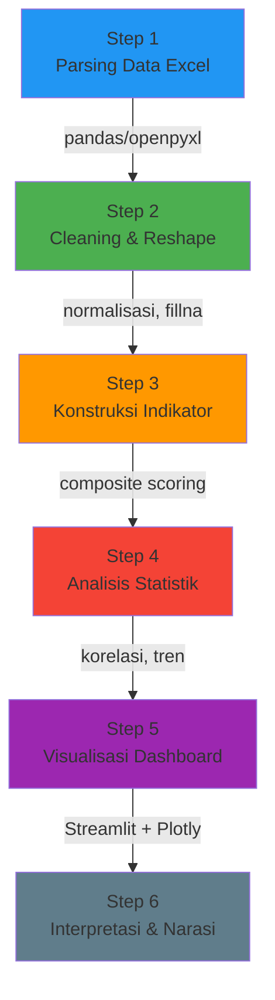

# 🔬 Metodologi Teknis: Dashboard LEUI

### Dokumentasi Pipeline — Data → Analisis → Visualisasi
### 31 Maret 2026

---

## Diagram Alur Metodologi



---

## Step 1: Parsing Data Excel

### Tool
`pandas` + `openpyxl` — membaca file CEIC/CDMNext export

### Tantangan Spesifik LEUI
| Masalah | Solusi |
|---|---|
| File CEIC punya metadata rows (Region, Frequency, dll) sebelum data aktual | Skip N rows, auto-detect header row |
| ICOR file = chart-only (data embed di chart cells) | Load via `openpyxl data_only=True` |
| IKK file mislabel (berisi investasi bukan CCI) | Rename/remap kolom secara programatis |
| Capital Outflow duplikat di 2 file | Deduplikasi, pakai satu sumber |
| 394 kolom sub-nasional | Melt ke long format: `(tanggal, provinsi, kabupaten, nilai)` |

### Pseudocode
```python
for each excel_file in ref/datamentah/:
    detect metadata rows (Region, Frequency, Unit, Source, etc)
    extract actual data rows (date + values)
    standardize column names
    save to data/processed/{nama}.csv
```

---

## Step 2: Cleaning & Reshape

### Operasi Utama

| Operasi | Detail | Library |
|---|---|---|
| **Skip metadata** | CEIC files: rows 0–25 = metadata, data mulai setelah "Max" row | `pandas` |
| **Parse dates** | Kolom tanggal format `datetime` → konversi ke period (bulanan/kuartalan) | `pd.to_datetime` |
| **Melt wide→long** | 394 kolom kabupaten → kolom (provinsi, kabupaten, nilai) | `pd.melt` |
| **Handle NaN** | Interpolasi untuk gap kecil, forward-fill untuk data kuartalan | `df.interpolate()` |
| **Harmonisasi periode** | Data harian (Capital Outflow) → di-aggregate ke bulanan (mean) | `df.resample('M').mean()` |
| **Normalisasi** | Min-Max untuk indikator komposit: `(x - min) / (max - min)` | `sklearn.preprocessing` |

### Output
```
data/processed/
├── icor_monthly.csv          # [date, pmdn_invest, pma_invest, gdp_growth, icor_pmdn, icor_pma]
├── realisasi_subnasional.csv # [date, provinsi, kabupaten, tipe (PMA/PMDN), nilai_idr_bn]  
├── capital_outflow.csv       # [date, net_sell_idr_tn]
├── ikk_sentiment.csv         # [date, ikk_expectation, ikk_present, gap]
├── pmi_monthly.csv           # [date, pmi_index]
└── metadata.json             # Source, frequency, last_update per dataset
```

---

## Step 3: Konstruksi Indikator

### 3.1 Investment Risk Barometer (Bisa dibangun sekarang)

| Indikator | Formula | Arah |
|---|---|---|
| **ICOR Efficiency** | `ICOR ratio` | ↑ = inefficient = more risk premium |
| **Capital Flight Signal** | `Net Sell 7-day MA` | ↑ = outflow meningkat |
| **PMI Health** | `PMI Index - 50` | < 0 = kontraksi |
| **Consumer Confidence Gap** | `IKK Expectation - IKK Present` | ↓ = confidence eroding |
| **Investment Concentration** | `Gini(realisasi per provinsi)` | ↑ = terkonsentrasi |

### 3.2 Legal Uncertainty Composite (Fase 2 — butuh data hukum)

| Dimensi | Proxy Sementara | Proxy Ideal |
|---|---|---|
| H1: Inconsistency | Variansi ICOR antar provinsi | Variansi putusan pengadilan |
| H2: Selective Enforcement | PMI drop saat event politik | Rasio kasus vs momentum |
| H3: Procedural | ICOR lag (delay cost) | Rata-rata waktu perkara |
| H4: Regulatory Reversal | Capital Outflow spikes | Jumlah pencabutan izin |
| H5: Criminalization | IKK drop saat high-profile case | Jumlah kasus pidana bisnis |

---

## Step 4: Analisis Statistik

| # | Analisis | Metode | Library | Input → Output |
|---|----------|--------|---------|----------------|
| 1 | **Tren Temporal** | Rate of Change, Moving Average | `pandas` | Time series → trend lines |
| 2 | **Korelasi Antar Indikator** | Pearson/Spearman Correlation | `scipy.stats` | Semua indikator → heatmap r + p-value |
| 3 | **Event Overlay** | Timeline annotation | `plotly` | Data ekonomi + event hukum → annotated chart |
| 4 | **Gap Analysis Regional** | Gini coefficient per metrik | `pandas` + custom | Distribusi provinsi → inequality score |
| 5 | **Anomaly Detection** | Z-score / IQR | `pandas` | Time series → outlier periods = potential legal events |

### Formula Utama

#### Rate of Change
```
ΔRate = ((V_t - V_t-1) / V_t-1) × 100
```

#### Korelasi Spearman
```
ρ = 1 - (6 × Σd²) / (n × (n² - 1))
```

#### Gini Coefficient (Ketimpangan Investasi)
```
G = (Σᵢ Σⱼ |xᵢ - xⱼ|) / (2n² × μ)
```

---

## Step 5: Visualisasi Dashboard (Streamlit + Plotly)

### Rencana Halaman

| Page | Konten | Visualisasi Utama |
|------|--------|-------------------|
| **Dashboard.py** | Overview — KPI Cards + ringkasan | Metric cards, sparklines |
| **Page 1: Risk Barometer** | ICOR + PMI + IKK + Capital Outflow | Multi-axis time series, annotated events |
| **Page 2: Investment Flow** | PMA/PMDN nasional + sub-nasional | Choropleth map, bar chart provinsi |
| **Page 3: Capital Flight** | Net Sell + korelasi dengan event | Area chart, spike detection |
| **Page 4: Consumer Sentiment** | IKK Expectation vs Present | Dual-line, gap fill chart |
| **Page 5: Eksplorasi Data** | Filter interaktif, tabel mentah | DataTable, download |
| **Page 6: Dokumentasi Riset** | Framework, metodologi, sumber | Static markdown render |

---

## Step 6: Interpretasi & Narasi

### Kriteria Seleksi Insight

```
1. MAGNITUDE    — angka yang besar secara absolut (ICOR > 10, Net Sell > 15 IDR tn)
2. OUTLIER      — spike/drop yang anomali (PMI < 48, IKK gap collapse)
3. TREND        — arah yang berlawanan dari harapan (ICOR naik saat investasi turun)
4. CONTRAST     — dua metrik yang kontras tajam (IKK optimis tapi capital flight tinggi)
5. TEMPORAL CO-OCCURRENCE — event hukum + indikator bergerak bersamaan
```

---

## Ringkasan Pipeline

| Step | Tool/Metode | Komputasional? | Status |
|------|-------------|----------------|--------|
| 1. Parsing Excel | `pandas` + `openpyxl` | ✅ Ya | Belum |
| 2. Cleaning/Reshape | `pandas` | ✅ Ya | Belum |
| 3. Konstruksi Indikator | Aritmatika + normalisasi | ✅ Ya | Belum |
| 4. Analisis Statistik | `scipy.stats` | ✅ Ya | Belum |
| 5. Visualisasi | `Streamlit` + `Plotly` | ✅ Ya | Belum |
| 6. Interpretasi | Editorial judgement | ❌ Tidak | Belum |

> [!IMPORTANT]
> Pipeline LEUI ini **sepenuhnya komputasional** di Step 1–5. Data sudah dalam format tabular (Excel from CEIC), bukan PDF yang butuh extraction. Ini memungkinkan akurasi dan reprodusibilitas yang tinggi.
