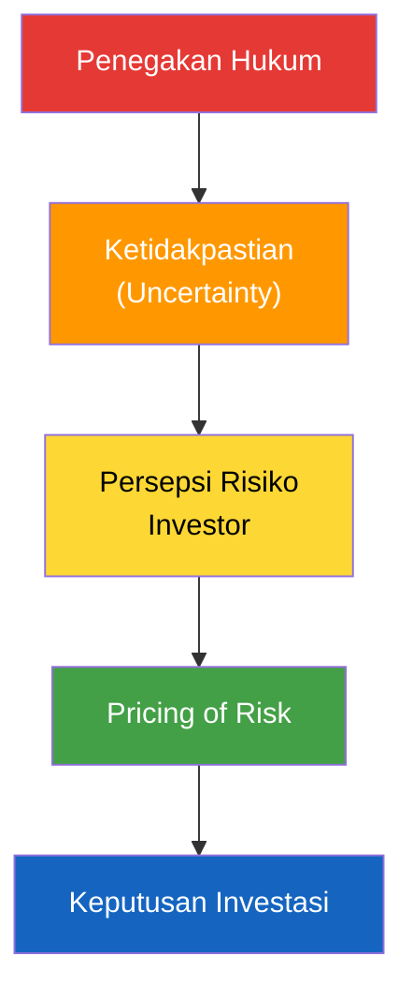

# 📑 Strategi Narasi & Arah Analisis Data LEUI

### CELIOS — Legal Enforcement Uncertainty Index
### 1 April 2026


> [!IMPORTANT]
> Dokumen ini menyajikan kerangka riset LEUI secara lengkap — premis, hipotesis, indikator, kerangka konseptual, dan arah analisis data.

---

## 1. Premis Dasar (Core Assumption)

> Penegakan hukum yang tidak konsisten, tidak transparan, dan mudah dipolitisasi menciptakan **ketidakpastian hukum**, yang kemudian dikonversi oleh pelaku usaha menjadi **risiko ekonomi** yang di-price dalam keputusan investasi.

**Intinya:** Bukan hukum buruk yang paling mahal, tapi **hukum yang tak bisa diprediksi**.

---

## 2. Hipotesis Utama (Legal Enforcement → Uncertainty)

5 dimensi penegakan hukum yang paling relevan buat investor:

### H1 — Inconsistency Risk
> Ketidakkonsistenan penegakan hukum antar wilayah, sektor, dan waktu meningkatkan ketidakpastian investasi.

**Contoh kasus:**
- Kasus serupa → hasil putusan berbeda
- Izin yang sah → tetap dikriminalisasi
- Tafsir pusat ≠ daerah ≠ aparat

**Uncertainty Type:** Outcome uncertainty

### H2 — Selective Enforcement Risk
> Penegakan hukum yang selektif dan transaksional menciptakan risiko non-teknis bagi investor.

**Contoh kasus:**
- Penindakan hanya muncul saat konflik politik
- Hukum dipakai sebagai alat negosiasi
- "Aman" selama ada kedekatan kekuasaan

**Uncertainty Type:** Political & discretion risk

### H3 — Procedural Uncertainty Risk
> Proses hukum yang panjang, tidak pasti, dan mahal menciptakan biaya laten bagi investasi.

**Contoh kasus:**
- Kasus pidana berjalan paralel dengan PTUN/perdata
- Penyitaan aset sebelum putusan inkracht
- Overlapping kewenangan penegak hukum

**Uncertainty Type:** Process risk

### H4 — Regulatory Reversal Risk
> Penegakan hukum yang berubah karena perubahan regulasi atau kebijakan mendadak meningkatkan risiko stranded asset.

**Contoh kasus:**
- Perizinan sah → tiba-tiba melanggar aturan baru
- Pencabutan izin retroaktif
- Kriminalisasi pasca pergantian pejabat

**Uncertainty Type:** Policy & regulatory risk

### H5 — Criminalization Risk
> Kriminalisasi keputusan bisnis atau kebijakan administratif meningkatkan risiko personal bagi investor & manajemen.

**Contoh kasus:**
- Direksi dijerat pidana
- Pejabat daerah takut tanda tangan
- Investor asing khawatir personal liability

**Uncertainty Type:** Personal & reputational risk

---

## 3. Mengubah Ketidakpastian → Risiko yang Bisa Di-Price

### Prinsip Dasar
Investor tidak bilang "hukum buruk", tapi mereka:
- Minta **higher return**
- Minta **risk premium**
- Minta **jaminan**
- Atau **tidak masuk sama sekali**

### Bentuk "Harga Risiko" (Risk Pricing Channels)

| Jenis Risiko | Cara Di-price |
|---|---|
| Legal uncertainty | Risk premium ↑ |
| Enforcement risk | Cost of capital ↑ |
| Criminalization risk | Insurance cost ↑ |
| Process risk | Delay cost ↑ |
| Regulatory reversal | Expected return ↓ |

---

## 4. Kerangka Konseptual (Framework)



**Versi teknis:**
```
Legal Enforcement Quality Index → Legal Uncertainty Score → Legal Risk Premium → Investment Behavior
```

---

## 5. Indikator yang Bisa Dibangun

### A. Legal Uncertainty Indicators

| Dimensi | Indikator Kuantitatif |
|---|---|
| Inconsistency | Variansi putusan kasus sejenis |
| Selectivity | Rasio kasus terhadap momentum politik |
| Procedural | Rata-rata lama penyelesaian kasus |
| Reversal | Jumlah pencabutan izin |
| Criminalization | Jumlah kasus pidana bisnis |

### B. Risk Pricing Indicators

| Risiko | Proxy Harga |
|---|---|
| Legal risk premium | Spread bunga pinjaman |
| Country risk | CDS Indonesia |
| Investment delay | Time-to-invest |
| Exit risk | Capital flight |
| Insurance cost | Political risk insurance |

---

## 6. Asumsi Kunci

1. Investor bersifat **risk-averse**
2. Ketidakpastian hukum **≠** buruknya hukum substantif
3. Risiko hukum bisa **dipersepsikan dan dihitung**
4. Penegakan hukum **lebih menentukan** dari teks hukum
5. Data proxy **cukup** untuk mengukur persepsi risiko

---

## 7. Kebutuhan Data

### Data Hukum
- Putusan MA/PT/PTUN
- Data kriminalisasi bisnis
- Data pencabutan izin
- Waktu proses perkara

### Data Ekonomi
- PMA/PMDN per sektor
- Cost of capital
- CDS Indonesia
- Data investasi daerah

### Data Persepsi
- Survei investor
- Wawancara pelaku usaha
- Laporan risk assessment

### Data Politik
- Perubahan pejabat
- Momentum pemilu
- Konflik pusat–daerah

---

## 8. Pertanyaan Besar Penelitian

### Utama:
> Bagaimana penegakan hukum di Indonesia menciptakan risiko yang di-price dalam keputusan investasi?

### Turunan:
1. Aspek penegakan hukum apa yang **paling mahal** secara ekonomi?
2. Apakah ketidakpastian hukum meningkatkan **cost of capital**?
3. Apakah investor lebih takut pada **hukum buruk** atau **hukum tak terduga**?
4. Apakah efeknya **berbeda antar sektor & daerah**?
5. Bagaimana investor **memitigasi** risiko hukum?

---

## 9. Output Riset

- **Legal Risk Pricing Index Indonesia**
- **Heatmap Risiko Hukum Investasi**
- **Policy Paper**: Reformasi Penegakan Hukum
- **Early Warning System** untuk investor & pemerintah

---

## 10. Mapping Data Tersedia → Indikator LEUI

> [!NOTE]
> Bagian ini memetakan indikator LEUI ke dataset yang tersedia.

### A. Legal Uncertainty Indicators → Status Data

| Dimensi | Indikator Kuantitatif | Data Tersedia? | Keterangan |
|---|---|---|---|
| Inconsistency | Variansi putusan kasus sejenis | ❌ | Butuh data putusan MA/PT |
| Selectivity | Rasio kasus vs momentum politik | ❌ | Butuh data kasus + kalender politik |
| Procedural | Rata-rata lama penyelesaian kasus | ❌ | Butuh data waktu perkara |
| Reversal | Jumlah pencabutan izin | ❌ | Butuh data pencabutan |
| Criminalization | Jumlah kasus pidana bisnis | ❌ | Butuh data kriminalisasi |

### B. Risk Pricing Indicators → Status Data

| Risiko | Proxy Harga | Data Tersedia? | Sumber Data |
|---|---|---|---|
| Legal risk premium | Spread bunga pinjaman | ❌ | — |
| Country risk | CDS Indonesia | ❌ | — |
| Investment delay | Time-to-invest | ❌ | — |
| Exit risk | Capital flight | ✅ | `PMI dan Capital Outflow.xlsx` (Bond Net Sell) |
| Insurance cost | Political risk insurance | ❌ | — |

### C. Data Ekonomi → Status Data

| Kebutuhan Data | Status | Sumber Data |
|---|---|---|
| PMA/PMDN per sektor | ✅ | `Data Realisasi Investasi.xlsx` (394 kab/kota) |
| Cost of capital | ✅ (proxy: ICOR) | `Biaya Investasi (ICOR).xlsx` |
| CDS Indonesia | ❌ | — |
| Data investasi daerah | ✅ | `Indeks Kepercayaan Konsumen.xlsx` (sub-nasional) |

### D. Data Tambahan yang Tersedia

| Data | File | Relevansi |
|---|---|---|
| Consumer Confidence (IKK) | `IKK (Expect vs Present).xlsx` | Proxy sentimen/persepsi investor |
| Manufacturing PMI | `PMI dan Capital Outflow.xlsx` | Leading indicator aktivitas ekonomi |

---

## 11. Narasi per Hipotesis (H1–H5)

> [!NOTE]
> Narasi dibangun langsung dari hipotesis LEUI. Masing-masing H dipasangkan dengan data yang tersedia.

### Narasi H1 — Inconsistency: "Kasus Sama, Putusan Beda"
- **Data ideal**: Variansi putusan → **belum tersedia**
- **Proxy sementara**: Variansi ICOR antar provinsi (sebagai indikasi cost inconsistency antar daerah)
- **Metode**: Hitung std. deviasi realisasi investasi per provinsi per kuartal

### Narasi H2 — Selectivity: "Hukum Tergantung Siapa"
- **Data ideal**: Rasio kasus vs momentum politik → **belum tersedia**
- **Proxy sementara**: IKK/PMI drop saat event politik besar
- **Metode**: Event study — overlay timeline event dengan data IKK/PMI

### Narasi H3 — Procedural: "Proses Tak Pasti, Biaya Laten"
- **Data ideal**: Rata-rata lama perkara → **belum tersedia**
- **Proxy sementara**: ICOR sebagai delay cost indicator
- **Metode**: Analisis lag — korelasi ICOR ↔ realisasi investasi pada lag 1–4 kuartal

### Narasi H4 — Reversal: "Izin Dicabut, Investor Lari"
- **Data ideal**: Jumlah pencabutan izin → **belum tersedia**
- **Proxy**: Capital Outflow (Bond Net Sell) — **TERSEDIA** ✅
- **Metode**: Anomaly detection (Z-score) pada Net Sell → identifikasi tanggal spike

### Narasi H5 — Criminalization: "Direksi Dijerat, Kepercayaan Runtuh"
- **Data ideal**: Jumlah kasus pidana bisnis → **belum tersedia**
- **Proxy**: IKK Expectation collapse — **TERSEDIA** ✅
- **Metode**: Gap analysis (Expectation − Present) → identifikasi confidence crisis

---

## 12. Metode Olah Data

| # | Metode | Untuk Hipotesis | Library |
|---|--------|-----------------|---------|
| 1 | Time Series + Moving Average | H1, H3 | `pandas` |
| 2 | Spearman Correlation | H1, H3 | `scipy.stats` |
| 3 | Event Study (timeline overlay) | H2 | `pandas` + `plotly` |
| 4 | Anomaly Detection (Z-score) | H4 | `pandas` |
| 5 | Gap Analysis (Expectation − Present) | H5 | `pandas` |
| 6 | Rate of Change | Semua | `pandas.pct_change` |
| 7 | Gini Coefficient | H1 (distribusi) | custom |
| 8 | Rolling Correlation | H4, H5 | `pandas.rolling` |

---

## 13. Strategi Struktur Halaman (Pages) Dashboard

Dashboard LEUI akan memecahkan kelima hipotesis (H1-H5) ke dalam halaman-halaman analitik khusus, dengan rincian berikut:

### 1. Halaman: Inconsistency Risk (H1)
- **Narasi Utama:** Kasus sama, putusan beda — memotret ketidakkonsistenan biaya investasi antar wilayah sebagai *proxy* kepastian hukum daerah.
- **Hipotesis:** H1 (Inconsistency Risk)
- **Data:** Biaya Investasi (ICOR) & Realisasi Investasi Regional.
- **Metode:** Variansi dan Distribusi (menggunakan Standard Deviation/Gini Ratio pada ICOR antar provinsi).

### 2. Halaman: Selective Enforcement (H2)
- **Narasi Utama:** Hukum tergantung momentum — pengaruh kalender dan event politik spesifik terhadap aktivitas ekonomi rill.
- **Hipotesis:** H2 (Selective Enforcement Risk)
- **Data:** IKK (Sub-nasional/Nasional) & PMI Manufaktur.
- **Metode:** Event Study (*overlay* timeline krisis politik/hukum dengan pergerakan *drop* pada PMI/IKK).

### 3. Halaman: Procedural Uncertainty (H3)
- **Narasi Utama:** Proses hukum tak pasti, biaya laten (*delay*) membengkak.
- **Hipotesis:** H3 (Procedural Uncertainty Risk)
- **Data:** Realisasi Investasi PMA/PMDN & ICOR Nasional.
- **Metode:** Time Series & Korelasi Lag (mengukur pengaruh perlambatan di satu periode terhadap investasi di kuartal berikutnya).

### 4. Halaman: Regulatory Reversal (H4)
- **Narasi Utama:** Keputusan/izin tiba-tiba dicabut, kejutan regulasi memicu modal kabur.
- **Hipotesis:** H4 (Regulatory Reversal Risk)
- **Data:** Capital Outflow (Harian: Net Sell Obligasi IDR).
- **Metode:** Anomaly Detection (pendeteksian lewat hitungan Z-score untuk menemukan spike *capital flight* yang ekstrem secara mendadak).

### 5. Halaman: Criminalization Risk (H5)
- **Narasi Utama:** Otoritas ketakutan atau direksi dikriminalisasi memicu keruntuhan keyakinan seketika.
- **Hipotesis:** H5 (Criminalization Risk)
- **Data:** Indeks Kepercayaan Konsumen (Ekspektasi vs Kondisi Saat Ini).
- **Metode:** Gap Analysis (identifikasi pelebaran *gap* terbalik antara ekspektasi yang tinggi dengan realitas present yang mendadak jatuh).

---

## Status & Next Steps

- [x] Framework, hipotesis, dan indikator tersusun
- [x] Mapping data tersedia ↔ indikator LEUI
- [ ] Parsing & cleaning data Excel → CSV
- [ ] Dashboard development berdasarkan hipotesis H1–H5
